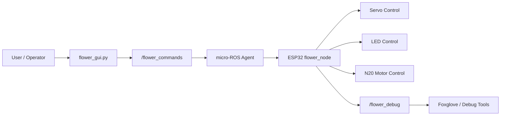

# LLM4MentalHealth

LLM4MentalHealth is a robotics project that explores how non-anthropomorphic social robots can support mental health and wellbeing. This robot enbodies a flower that combines flower petal movement, color, a neck joint and a dual stage tendon driven continuum stem into a single interactive platform. 

## Project vision

The flower robot is designed to act as a non-verbal companion that can communicate emotion and intent through:

- five independently addressable petal LEDs,
- five petal-angle actuators,
- a motorized stem / continuum-style drive system,
- a ROS 2-based control interface for real-time command and monitoring.

### Physical layout summary

- Embedded controller: ESP32-based microcontroller running the firmware.
- Communication: Wi-Fi + micro-ROS bridge to a host computer.
- Operator interface: a Tkinter-based GUI and ROS 2 topics.
- Control: Servo motors, N20 Encoded gear motor, Addressible RGB LED Neopixels

## Repository structure

- [README.md](README.md): project-level overview and architecture.
- [FullCode_ws](FullCode_ws): host-side ROS 2 workspace, GUI, and message definitions.
- [FullCodeMICROCONTROLLEr](FullCodeMICROCONTROLLEr): embedded firmware for the ESP32-based flower robot.
- [Testing](Testing): hardware and software experiments, prototypes, and validation sketches.

## Software architecture

The system uses a split architecture:

- A host-side ROS 2 layer publishes high-level commands.
- A micro-ROS agent bridges those commands over Wi-Fi to the ESP32.
- The embedded firmware interprets the command stream and drives the robot’s motors, LEDs, and servos.

### Core control flow

1. A user manipulates the GUI or a ROS topic publisher.
2. The host sends a RobotCommand message over ROS 2.
3. The micro-ROS bridge forwards the message to the ESP32.
4. The ESP32 updates servo positions, LED colors, and motor target state.
5. The embedded firmware continuously applies the new state and reports debugging information.

## ROS node map

### ROS topics and roles

- /flower_commands
  - Custom message type: RobotCommand.
  - Carries servo angles, LED brightness, LED colors, and N20 motor target state.

- /flower_debug
  - Debug string topic used for troubleshooting and runtime telemetry.

### ROS-side components

- flower_gui.py
  - Runs as a ROS 2 node named flower_gui_node.
  - Publishes command messages to /flower_commands.

- flower.launch.py
  - Launches the micro-ROS agent, Foxglove bridge, and GUI in one place.

## Notes
For deeper implementation detail, see the READMEs in the subprojects:

- [FullCode_ws](FullCode_ws)
- [FullCodeMICROCONTROLLEr](FullCodeMICROCONTROLLEr)
