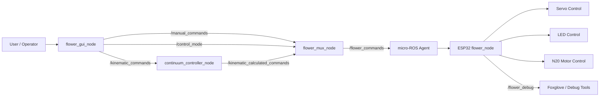

# LLM4MentalHealth

LLM4MentalHealth is a robotics project that explores how non-anthropomorphic social robots can support mental health and wellbeing. The robot embodies a flower that combines petal movement, color, and a dual-stage tendon-driven continuum stem into a single interactive platform.

## Project vision

The flower robot is designed to act as a non-verbal companion that can communicate emotion and intent through:

- five independently addressable petal LEDs,
- four petal-angle actuators,
- a motorized stem / continuum-style drive system,
- a ROS 2-based control interface for real-time command and monitoring.

### Physical layout summary

- Embedded controller: ESP32-based microcontroller running the firmware.
- Communication: Wi-Fi + micro-ROS bridge to a host computer.
- Operator interface: a Tkinter-based GUI and ROS 2 topics.
- Control: servo motors, N20 encoded gear motor, addressable RGB LED NeoPixels.

## Repository structure

- [README.md](README.md): project-level overview and architecture.
- [FullCode_ws](FullCode_ws): host-side ROS 2 workspace, GUI, and message definitions.
- [FullCodeMICROCONTROLLEr](FullCodeMICROCONTROLLEr): embedded firmware for the ESP32-based flower robot.
- [Testing](Testing): hardware and software experiments, prototypes, and validation sketches.
- [Construction](Construction): bill of materials and laser-cut sketches for the physical build.

## Software architecture

The system uses a split architecture:

- A host-side ROS 2 layer publishes high-level commands from the GUI, an optional kinematic solver, and perception nodes.
- A mux node merges those sources into a single authoritative command stream.
- A micro-ROS agent bridges that stream over Wi-Fi to the ESP32.
- The embedded firmware interprets the command stream and drives the robot’s motors, LEDs, and servos.

### Core control flow

1. A user manipulates the GUI, in either manual or kinematic mode.
2. The GUI publishes RobotCommand data to /manual_commands (and, in kinematic mode, bend targets to /kinematic_commands).
3. In kinematic mode, the continuum controller converts those bend targets into per-servo angles and publishes them to /kinematic_calculated_commands.
4. flower_mux selects manual or kinematic data based on /control_mode and publishes one merged RobotCommand to /flower_commands.
5. The micro-ROS agent forwards /flower_commands to the ESP32.
6. The ESP32 updates servo positions, LED colors, and motor target state, and reports debugging information back over /flower_debug.

## ROS node map

```mermaid
flowchart LR
    A["User / Operator"] --> B[flower_gui_node]
    B -->|/manual_commands| M[flower_mux_node]
    B -->|/kinematic_commands| K[continuum_controller_node]
    B -->|/control_mode| M
    K -->|/kinematic_calculated_commands| M
    M -->|/flower_commands| D[micro-ROS Agent]
    D --> E[ESP32 flower_node]
    E --> F[Servo Control]
    E --> G[LED Control]
    E --> H[N20 Motor Control]
    E -->|/flower_debug| J["Foxglove / Debug Tools"]
```

### ROS topics and roles

- /manual_commands, /kinematic_commands, /control_mode
  - Published by flower_gui_node; the raw manual/kinematic operator input and the active mode.

- /kinematic_calculated_commands
  - Published by continuum_controller_node; per-servo angles solved from the kinematic bend targets.

- /flower_commands
  - Custom message type: RobotCommand.
  - Published by flower_mux_node; the single merged command stream (servo angles, LED brightness, LED colors, N20 motor target state) that the embedded firmware actually receives.

- /flower_debug
  - Debug string topic published by the ESP32, used for troubleshooting and runtime telemetry.

### ROS-side components

- flower_gui_node
  - Tkinter-based operator dashboard.
  - Publishes to /manual_commands, /kinematic_commands, and /control_mode.

- continuum_controller_node
  - Kinematic solver; converts bend commands into antagonistic servo-pair angles.

- flower_mux_node
  - Mode-aware multiplexer; merges GUI and kinematic sources into /flower_commands.

- flower.launch.py
  - Launches the micro-ROS agent, Foxglove bridge, GUI, perception nodes, mux, and kinematic controller together.

For the full topic-level breakdown (including the vision/perception nodes), see [FullCode_ws](FullCode_ws).

## Notes

For deeper implementation detail, see the READMEs in the subprojects:

- [FullCode_ws](FullCode_ws)
- [FullCodeMICROCONTROLLEr](FullCodeMICROCONTROLLEr)
- [Construction](Construction)
